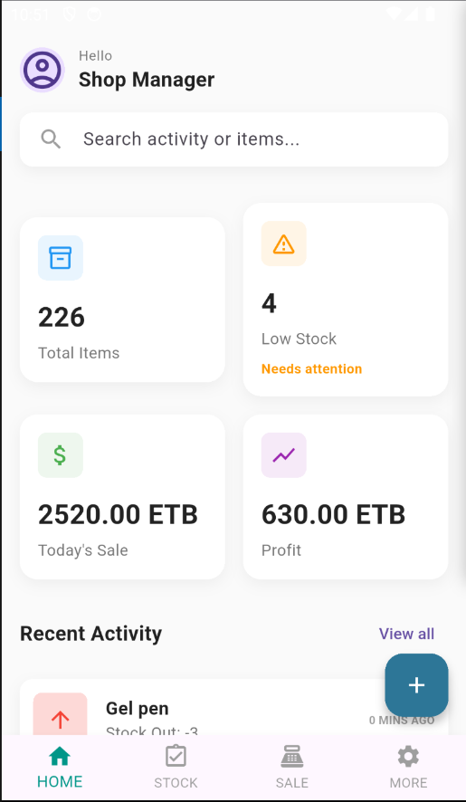
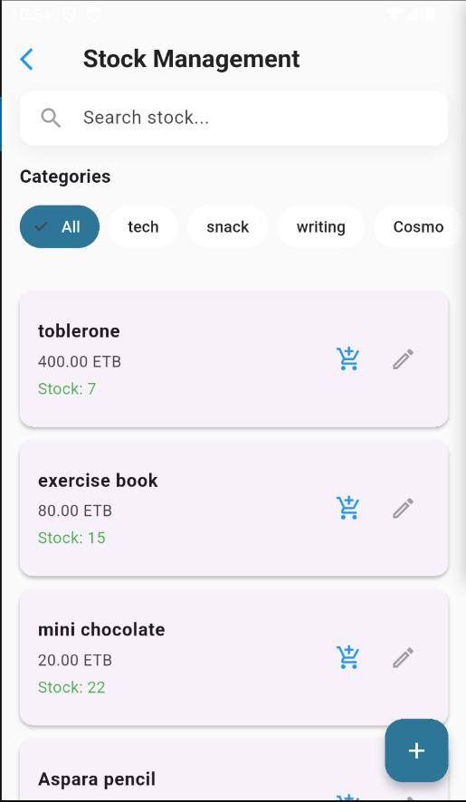
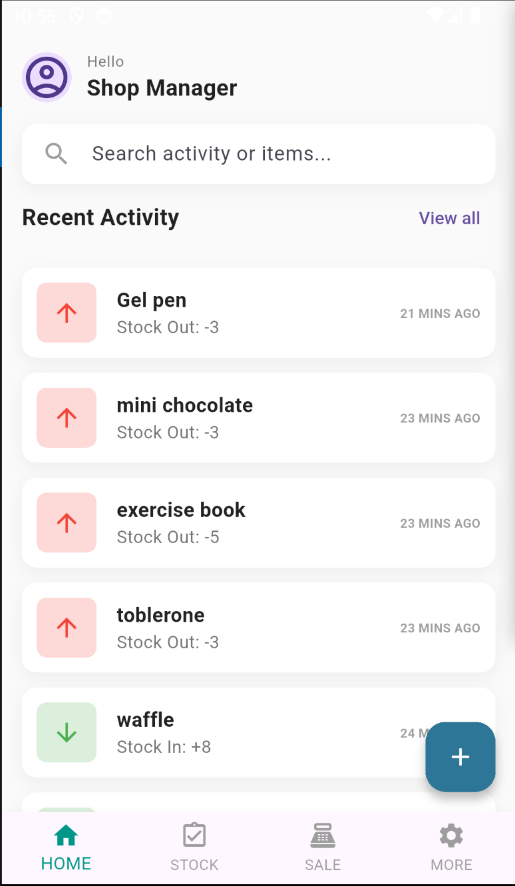

# Shop IMS (Inventory Management System)

A robust Flutter-based mobile application designed to streamline shop management operations. This application allows shop owners to manage inventory, track stock levels, process sales, and view basic reports efficiently.

## Features

*   **Dashboard Overview**: Get a quick snapshot of your shop's performance and recent activity.
*   **Inventory Management**:
    *   Add, edit, and delete products easily.
    *   Organize products into custom categories.
    *   View detailed product information.
*   **Stock Tracking**:
    *   Real-time monitoring of stock levels.
    *   Restocking workflow to update inventory quantities.
    *   Visual indicators for low stock.
*   **Point of Sale (POS)**:
    *   Streamlined interface for processing sales.
    *   Add products to cart and calculate totals automatically.
*   **Reporting**:
    *   Access daily and weekly sales reports.
    *   View transaction history.
*   **User Management**:
    *   Secure login screen for authorized access.

## Screenshots

| Dashboard | Inventory | Sales |
|:---:|:---:|:---:|
|  |  |  |

*(Note: Screenshots are placeholders. Please add actual app screenshots to an `assets/screenshots` folder.)*

## Tech Stack

*   **Framework**: [Flutter](https://flutter.dev/)
*   **Language**: [Dart](https://dart.dev/)
*   **Database**: [SQLite](https://pub.dev/packages/sqflite) (via `sqflite`)
*   **State Management**: Native Flutter (`setState`, `ValueNotifier`)
*   **Utilities**:
    *   `intl`: Date and number formatting.
    *   `path`: File path manipulation.

## Project Structure

```
lib/
├── main.dart             # Application entry point
├── models/               # Data Transfer Objects (DTOs)
│   └── models.dart       # Product, Category, Sale, etc. models
├── pages/                # UI Screens
│   ├── home_page.dart    # Main dashboard
│   ├── login_page.dart   # Authentication screen
│   ├── add_product_page.dart # Product creation/editing
│   ├── stock_page.dart   # Inventory list and management
│   ├── sale_page.dart    # Point of Sale interface
│   ├── add_category_page.dart # Category management
│   ├── more_reports.dart # Reporting interface
│   └── coming_soon_page.dart # Placeholder for future features
└── services/             # Business Logic & Data Access
    ├── db_helper.dart    # Database connection and helper methods
    └── dao.dart          # Data Access Objects (CRUD operations)
```

## Setup & Installation

Ensure you have Flutter installed on your machine. [Flutter Installation Guide](https://docs.flutter.dev/get-started/install)

1.  **Clone the repository:**
    ```bash
    git clone https://github.com/yourusername/shop_ims.git
    cd shop_ims
    ```

2.  **Install dependencies:**
    ```bash
    flutter pub get
    ```

3.  **Run the application:**
    Connect a device or start an emulator, then run:
    ```bash
    flutter run
    ```

## Configuration

*   **Database**: The app uses a local SQLite database (`shop.db`). No external database configuration is required.
*   **Environment Variables**: Currently, the app does not rely on `.env` files. Access credentials or constants are managed within the application code.

## Known Limitations / TODOs

*   [ ] Implement specific unit and widget tests.
*   [ ] Add data export functionality (CSV/PDF).
*   [ ] Enhance "Coming Soon" pages with actual implementation.
*   [ ] Improve UI accessibility and localization.

## Contributing

Contributions are welcome!

1.  Fork the project.
2.  Create your feature branch (`git checkout -b feature/AmazingFeature`).
3.  Commit your changes (`git commit -m 'Add some AmazingFeature'`).
4.  Push to the branch (`git push origin feature/AmazingFeature`).
5.  Open a Pull Request.

## License

Distributed under the MIT License. See `LICENSE` for more information.
